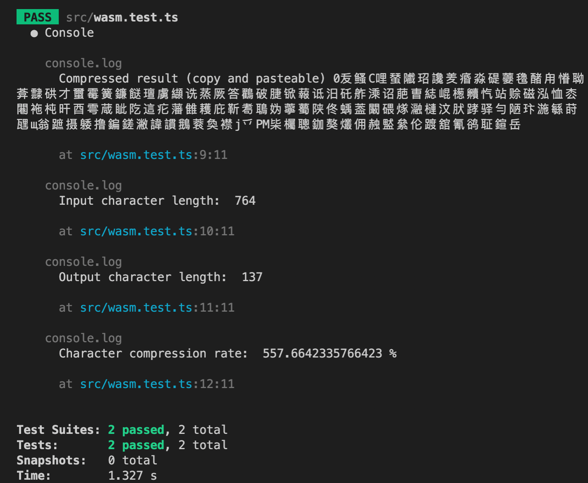

# brotli-unicode

This library compresses using the Brotli algorithm, based on WebAssembly.
After the compression has been done, another character encoding/compression algorithm is applied: `base-unicode`
`base-unicode` transcodes the `Uint8Array` into a Unicode string that is shorter than the original text (character wise).
Data in this form can also be copy-pasted when modern system fonts are used. Also, modern browsers allow Unicode
in URIs. Therefore, data compressed and encoded with this library can be transmitted via URLs.

For decoding, you can either use the JS variant, which is much smaller in code size, or you can also use the
WebAssembly implementation.

This algorithm allows for stellar compression ratios on text and binary data.
In our test scenario we're proud to present a compression rate of 558%.



## Setup

As a package for development (Node.js, Browsers):

```bash
  yarn add brotli-unicode

  # or

  npm i brotli-unicode
```

## Usage of the WASM variant

The usage in a Node.js or Browser environment is trivial:

```ts
// import size (uncompressed, but minified) / WASM version / max performance: 1.8M
import { compress, decompress } from 'brotli-unicode'

// Node.js or using the buffer package
let input = Buffer.from('Hello🤖!')

// alternatively, in-browser (without any third-party libraries)
input = TextEncoder.encode('Hello🤖!')

// it takes a Uint8Array and returns a base-unicode encoded string (copy and pasteable)
const compressed = await compress(input)

// it takes the base-unicode encoded string and returns a Uint8Array
const decompressed = await decompress(compressed)

// Node.js or using the buffer package
let output = Buffer.from(decompressed)

// alternatively, in-browser (without any third-party libraries)
output = TextDecoder.decode(decompressed)
```

Please note that the WASM version comes with a whopping size of (minified)
1.8MiB. This is, because the binary is base64 encoded and inlined.

If you prefer maximum performance and memory efficiency over small bundle size,
choose the WASM variant. Also, if you need compression, use the WASM version.

## Usage of the pure JS variant

If you need a small bundle size, can effort the slowdown and
only need decompression, use the hard-written JavaScript decompressor:

```ts
// import size (uncompressed, but minified) / JS version / only decompress / slower: 152K
import { decompress } from 'brotli-unicode/js'

// please also note that the pure JS variant is synchronous
// for large inputs, you could optimize the execution by moving
// this call into a Worker

// it takes a base-unicode encoded string and returns a Uint8Array
const decompressed = decompress(compressed)

// Node.js or using the buffer package
let output = Buffer.from(decompressed)

// alternatively, in-browser (without any third-party libraries)
output = TextDecoder.decode(decompressed)
```

## Options

The `compress` method comes with a second `options` parameter.

### Quality level

The most common setting is `quality` with a scale from 0 to 11.
By default, the quality is set to best quality (11).

```ts
const compressed = await compress(Buffer.from('foobar'), { quality: 9 })
```

A lower quality value makes the output bigger but improves compression time.
In 99.9% of the cases, you don't want to change this value.

### Custom dictionary

The relevant options here is `customDictionary`. You can set this to an Uint8Array string
of tokens which should be part of the `a priori` known dictionary. This can be useful
if you have power over both, the sender and the receiver part and if you know exactly
which tokens will be used alot in the input. For example, if you know that you'll
be compressing text, encoded as UTF16/UCS-2 and you know that the content is TypeScript code,
you could include the keywords of the TypeScript language in the custom dictionary.

Please mind, that you need to set the same value for decoding as well.

```ts
// with this configuration, "let" must not be encoded in the dictionary and carried as part of the
// payload. The binary tree (huffman coding tree)
const customDictionary = Buffer.from('let')
const compressed = await compress('let foo = 123; let bar = "foo";', { customDictionary })
const decompressed = await decompress(compressed, { customDictionary })
```

## Limitations

There is no streaming compression/decompression yet. It can be simply done by exposing the API from the WASM implementation.
If you need that, pls. ping via Issue.

## Build

    yarn build

## Test

    yarn test
